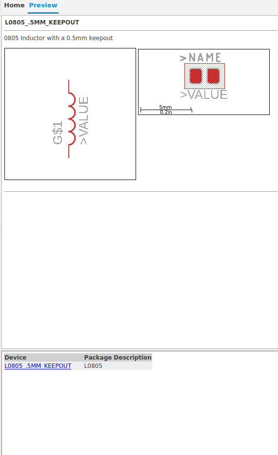

# Ealge BOM generator

This script allows to fully automate the BOM creation using the native BOM generator from Eagle CAD. This script is based on the components used having those fields in the library:



For this script to work is recommended to adapt already created libraries (i.e: manufacturer's libraries) to have this settings, which means that you would need to create a new library, import both symbol and footprint and then create your "own" component.

## How to obtain the BOM

First of all you will need to add three things manually after creating your schematic (for passives, only two for ICs): the value, the manufacturer and the part number. By doing this you will already have in you schematic the components you will be using, which can be handy for adaptation of the schematic or reproduction of it. So after you add all you components you will have a schematic just like this:


Then by using the `value` command you can manually insert the value of each component and obtain this schematic:


Then you will need to add the attributes to the components by using the `attribute` command, that will open this window:


You can add an attribute by clicking in new, then you will need to insert the `name` and the `value` of the attribute as shown here:


Here you need to add the `MANUFACTURER` attribute as shown before and the `PN` attribute that is the part number. After doing that you can click in the ULP button in the top side of the Eagle Schematic. Then you will need to choose the `bom` ULP native from Eagle:


Now the only thing you need to do is choose the right settings for the ULP and running it:


## Dependencies

`sudo apt install python3`
`pip3 intall pandas argparse`

## Usage of the script

The script can be now used by simply running the following command in the terminal:

```
./eagleBOM.py -file samples/sample1.csv
```

>**Note**: This may seem like a complex way to do it all, but it increases the reliability of the BOM generating process

